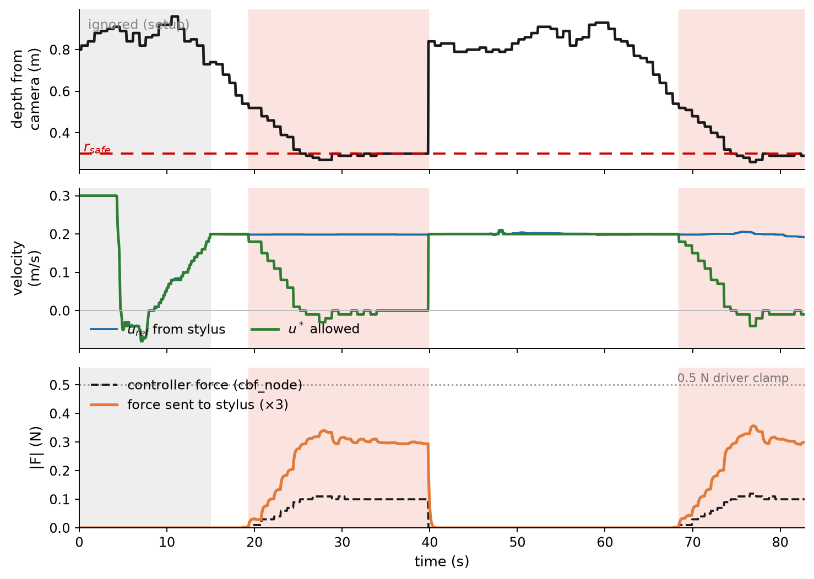
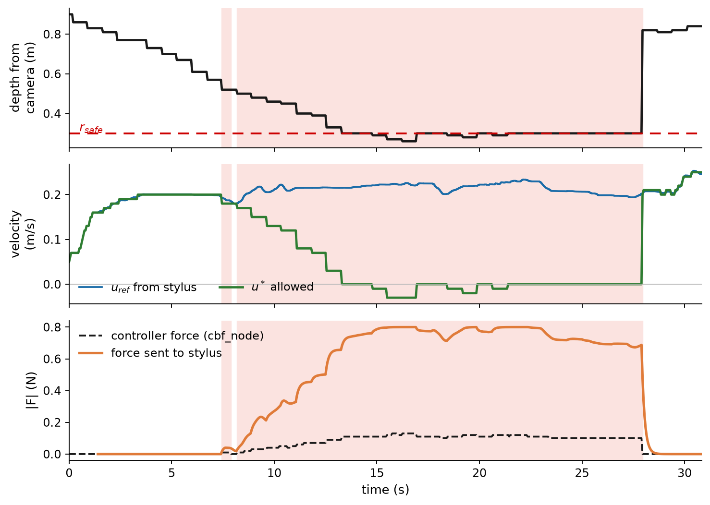

# Haptic testing — Geomagic Touch in the loop

First tests of the CBF force reaching a human hand through the Geomagic Touch.
No robot in the loop yet. Lab PC, 7 Oct 2026.

## Setup

| component | setting |
|---|---|
| driver | `omni_common` (`~/ws_touch`), with `patches/omni_state.cpp`; 1 kHz, mm; 0.5 N hard clamp for Stages 1–2b, 0.8 N for 2c |
| `depth_node` | quadratic calibration (`depth_calib:=quadratic`) |
| `cbf_node` | `r_safe` 0.30 m, `gamma` 0.8, `kf` 0.5, `f_max` 0.3 N, 20 Hz |
| `haptic_teleop` | dead zone 5 mm, `k_lin` 0.006, low-pass `f_alpha` 0.3; `f_scale` / `f_max` varied below (defaults now 8 / 0.8 N, from Stage 2c) |

## Stage 1 — synthetic depth

`/depth/closest` published by hand at fixed values; stylus provides `/cmd_vel_ref`.

| check | result |
|---|---|
| driver at 1 kHz, position in mm, inkwell position repeatable across launches | pass |
| stylus → command: forward `+linear.x`, back `−`, left `+angular.z`, right `−` | pass (left-positive is the ROS convention) |
| force reaches driver at the commanded size (`/phantom/force_feedback`) | pass: −0.04 N for −0.04 N commanded |
| silent when obstacle far (`z` = 1.00 m) | pass |
| force direction: switch obstacle 1.00 → 0.25 m while holding forward | pass: pushes hand back |
| force direction: at 0.25 m, loosen grip | pass: stylus drifts back toward operator |
| perceptible at `f_max` 0.05 N | no — lost in device friction |
| perceptible at `f_max` 0.15 N | faint |
| perceptible at `f_scale` 3, `f_max` 0.5 | yes when the force switches on; a slow ramp is much harder to notice |
| force update rate (`/phantom/force_feedback`) | 20 Hz (set by `cbf_node`'s timer) |

## Stage 2 — recorded approach (`approach` bag)

Real perception: box slid toward the camera, replayed through `depth_node` → `cbf_node`.
Operator held the stylus at `u_ref` ≈ 0.20 m/s. `f_scale` 3, `f_max` 0.5.



Grey = setup, ignored. Pink = filter active.

| measurement | approach 1 | approach 2 |
|---|---|---|
| ramp, first activation to peak | 8.7 s | 8.4 s |
| peak force at stylus | 0.340 N | 0.357 N |
| force while box held at boundary | 0.304 ± 0.011 N | 0.312 ± 0.017 N |

- **Force at the stylus is exactly `f_scale` × the controller force** (ratio 2.98). Nothing lost between `cbf_node` and the driver.
- **The operator's hand did not yield**: `u_ref` = 0.199 ± 0.002 m/s while active. The full ~0.3 N arrived and was easily held against.
- **Wobble from depth noise is small**, ±0.02 N on 0.30 N (~7%). Felt as "mostly steady". No depth filtering needed for now.
- **Onset was gradual**, and direction was never reversed. Operator report: force "barely perceptible".
- The instant drop at ~40 s is the bag looping (box jumps back to far), not real behaviour.

Stage 2b, `f_scale` 4 (≈0.48 N peak, just under the driver clamp): more noticeable than `f_scale` 3 and definitely felt, though the size of the improvement was hard to judge. Not recorded.

## Stage 2c — driver clamp raised to 0.8 N

Same as Stage 2, with the driver clamp in `patches/omni_state.cpp` raised from 0.5 to 0.8 N (rebuilt in `~/ws_touch`, confirmed with `grep`). `haptic_teleop` at `f_scale` 8, `f_max` 0.8.



| measurement | value |
|---|---|
| ramp, first activation to peak | 8.7 s (unchanged — set by the box's approach speed) |
| peak force at stylus | 0.800 N (at the clamp, ~15–23 s) |
| force while box held at boundary | 0.749 ± 0.042 N |
| `u_ref` while active | 0.214 ± 0.011 m/s |

- **The clamp now shapes the force.** The controller asks for ~0.11 N, which `f_scale` 8 turns into ~0.9 N, so the force ramps until about 0.33 m and then sits flat at 0.8 N: a growing warning that becomes a constant push near the boundary.
- **The operator's hand responded.** `u_ref` varied about five times more than in Stage 2. At ~18.4 s the force pushed the hand back (0.225 → 0.20 m/s) before the operator pushed back, and on average the operator pushed *harder* while the force was on, consistent with bracing against a felt force.
- **Operator report:** clearly stronger, "a lot more resistance", and preferred over the lower settings. Still possible to push through, as expected for a 0.8 N cue.

## Findings

1. **The pipeline is correct end to end**: magnitude, direction and on/off behaviour all match the controller.
2. **Up to 0.5 N the force is too weak to be a useful cue.** 0.3 N is easily held against, and a force that builds over several seconds is much harder to notice than one that appears at once. **At 0.8 N it is clearly felt** and the operator preferred it (Stage 2c).
3. **The slow ramp is partly built into the CBF.** Near the boundary the filter slows the approach exponentially, with time constant 1/γ = 1.25 s, so the force creeps in. On the live robot the ramp should take roughly 3–4 s; in this test it was ~8.5 s because the box was slid slowly (~4 cm/s).

## Open questions

- **Magnitude.** 0.8 N with `f_scale` 8 is the current preference. Going higher means approaching the Touch's ~0.88 N continuous rating (3.3 N peak), so sustained contact should stay at or below 0.8 N.
- **Shape.** At `f_scale` 8 the force ramps and then flattens at the clamp. Is that the right cue, or should the onset be steeper (higher `kf`, or higher `γ` so the barrier engages later and closes faster), or the ramp kept fully graded below the clamp (lower `f_scale`, higher clamp)?

## Must fix before the live robot

- **Docked stylus = full speed ahead.** The inkwell sits at `y` = +88 mm, which `haptic_teleop` maps to the +0.3 m/s maximum. Needs a dead-man switch on the stylus button, or a recentred zero.
- **`cbf_node` stop-on-exit doesn't work.** On Ctrl-C it publishes a zero `Twist` after the ROS context is already shut down, so the stop never sends.

## Reproduce

All terminals need both workspaces sourced (`humble`, `~/ws_touch`, `~/Documents/ellen/ros2_ws`). Stylus docked when the driver launches.

```bash
ros2 launch omni_common omni_state.launch.py
ros2 run depth_estimation_pkg haptic_teleop --ros-args -p f_max:=0.5 -p f_scale:=3.0
ros2 run depth_estimation_pkg depth_node
ros2 run depth_estimation_pkg cbf_node
ros2 bag play ~/Documents/ellen/approach --loop
ros2 bag record -o stage2_force /cbf/debug /phantom/force_feedback /cmd_vel_ref
```

Plot a recording (no ROS needed):

```bash
python3 plot_force_bag.py stage2_force stage2_force.png --skip 15
```

The driver prints `[FATAL] Unknown calibration status` once at startup. Harmless: the calibration loop in `omni_state.cpp` has no branch for "calibration just finished", so it prints this once and then proceeds normally. A real failure would repeat every second and never reach the "Publishing" lines.
